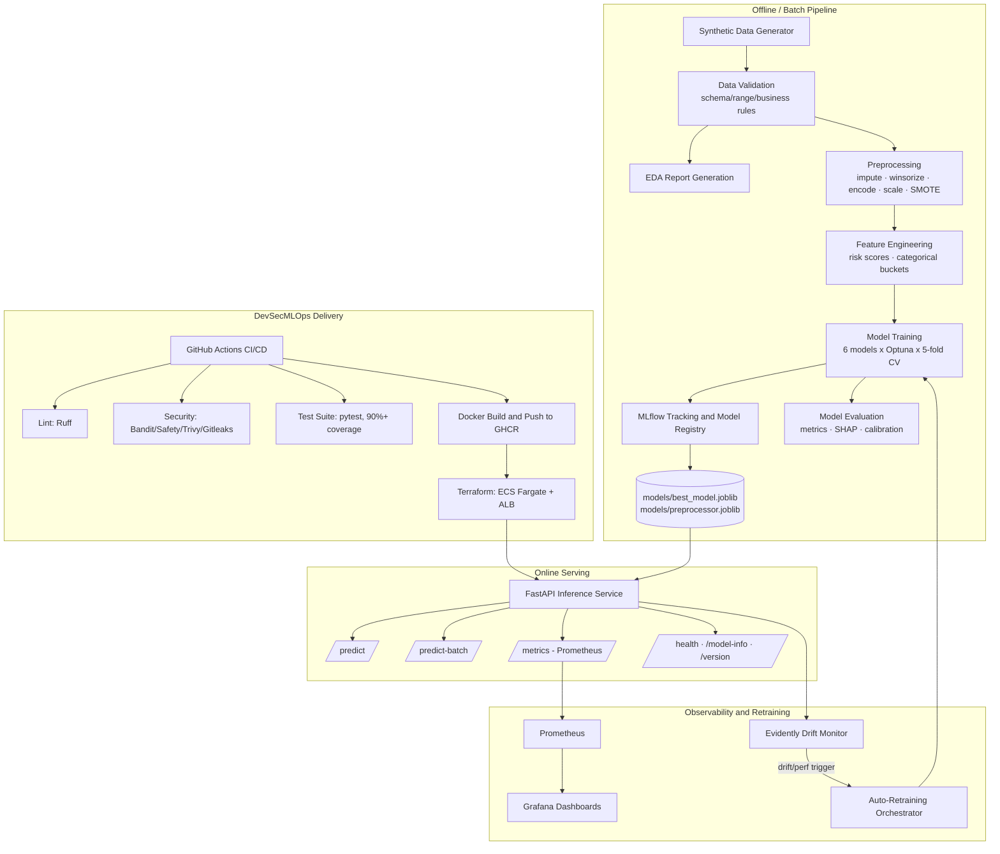
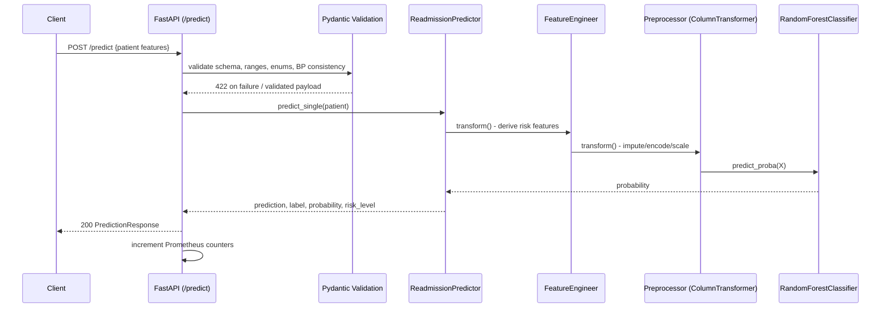

# Architecture

## System Overview

## Request Flow: `/predict`

## Component Responsibilities

| Layer | Module(s) | Responsibility |
|---|---|---|
| Data Generation | `src/data_generation/` | Synthetic dataset with realistic risk structure |
| Validation | `src/validation/validate_data.py` | Schema/range/business-rule gate before downstream use |
| EDA | `src/validation/eda.py` | Exploratory visualizations & summary stats |
| Feature Engineering | `src/feature_engineering/` | Clinically-motivated derived features |
| Preprocessing | `src/preprocessing/` | Cleaning, imputation, encoding, scaling, SMOTE |
| Training | `src/training/train.py` | CV + Optuna tuning across 6 model families, MLflow tracking |
| Evaluation | `src/evaluation/evaluate.py` | Metrics, curves, calibration, SHAP |
| Inference | `src/inference/predictor.py` | Loads artifacts once, serves single/batch predictions |
| API | `src/api/` | FastAPI app, Pydantic schemas, Prometheus instrumentation |
| Monitoring | `src/monitoring/drift_detection.py` | Evidently AI drift analysis |
| Retraining | `src/retraining/retrain_trigger.py` | Drift/performance-triggered retraining orchestration |
| Utils | `src/utils/` | Config loading, structured Loguru logging |

## Why These Design Choices

- **ColumnTransformer + joblib bundle**: the fitted preprocessor, feature
  engineer, and feature-name list are persisted together
  (`models/preprocessor.joblib`) so inference-time transformation is
  guaranteed identical to training-time transformation — a common source of
  training/serving skew if handled separately.
- **SMOTE only on the training fold**: applied after the train/test split so
  the held-out test set reflects the true (imbalanced) population and
  evaluation metrics aren't optimistically biased.
- **MLflow with a SQLite backend**: zero external dependencies for local/CI
  runs; swap `training.mlflow_tracking_uri` in `configs/config.yaml` for a
  remote tracking server in a real multi-user deployment.
- **Native validation engine over a live Great Expectations context**: the
  rule set (schema/dtype/missing/duplicate/range/categorical/binary/business
  rule/target checks) is a pandas-based superset of what a GE
  ExpectationSuite enforces, avoiding GE's heavier context/store
  bootstrapping for a single-table pipeline while remaining portable to one.
